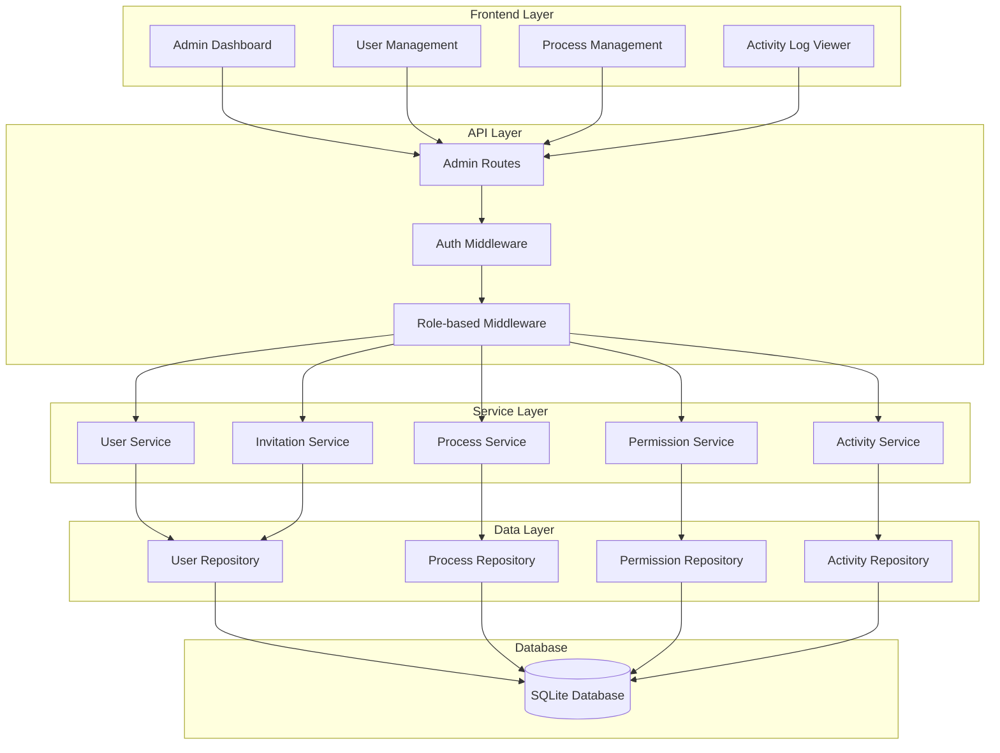
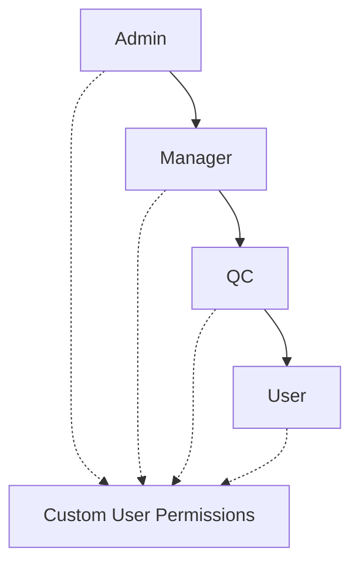

# Design Document

## Overview

The Admin Management System extends the existing ScholarFinder application with comprehensive administrative capabilities. The system builds upon the current Express.js/Prisma/SQLite architecture and implements role-based access control with four distinct actor types: User, Admin, QC (Quality Control), and Manager. The design emphasizes security, auditability, and scalability while maintaining consistency with the existing codebase patterns.

## Architecture

### High-Level Architecture



### Role-Based Access Control

The system implements a hierarchical permission model:



## Components and Interfaces

### 1. Database Schema Extensions

**New Tables:**
- `user_invitations` - Manages pending user invitations
- `permissions` - Defines available system permissions
- `user_permissions` - Custom permissions assigned to individual users
- `role_permissions` - Default permissions for each role
- `user_sessions` - Tracks active user sessions for blocking functionality

**Extended Tables:**
- `users` - Add fields: `status`, `blocked_at`, `blocked_by`, `invited_by`, `invitation_token`
- `activity_logs` - Add fields: `ip_address`, `user_agent`, `resource_type`, `resource_id`

### 2. Core Services

#### UserManagementService
```typescript
interface UserManagementService {
  // User lifecycle management
  inviteUser(email: string, role: UserRole, invitedBy: string): Promise<UserInvitation>;
  activateUser(token: string, userData: UserActivationData): Promise<User>;
  updateUser(userId: string, updates: UserUpdateData): Promise<User>;
  deleteUser(userId: string, deletedBy: string): Promise<void>;
  
  // Role and status management
  promoteToAdmin(userId: string, promotedBy: string): Promise<User>;
  blockUser(userId: string, blockedBy: string, reason?: string): Promise<User>;
  unblockUser(userId: string, unblockedBy: string): Promise<User>;
  
  // Permission management
  assignCustomPermissions(userId: string, permissions: Permission[]): Promise<void>;
  removeCustomPermissions(userId: string, permissions: Permission[]): Promise<void>;
  getUserEffectivePermissions(userId: string): Promise<Permission[]>;
}
```

#### ProcessManagementService
```typescript
interface ProcessManagementService {
  // Process lifecycle
  createProcess(processData: ProcessCreationData, createdBy: string): Promise<Process>;
  updateProcess(processId: string, updates: ProcessUpdateData): Promise<Process>;
  deleteProcess(processId: string, deletedBy: string): Promise<void>;
  
  // Process control
  resetProcessStage(processId: string, targetStage: ProcessStep, resetBy: string): Promise<Process>;
  getProcessTemplates(): Promise<ProcessTemplate[]>;
  
  // Process monitoring
  getProcessMetrics(): Promise<ProcessMetrics>;
  getActiveProcesses(): Promise<Process[]>;
}
```

#### PermissionService
```typescript
interface PermissionService {
  // Permission validation
  hasPermission(userId: string, permission: string, resource?: string): Promise<boolean>;
  checkPermissions(userId: string, permissions: string[]): Promise<PermissionCheckResult>;
  
  // Role management
  updateRolePermissions(role: UserRole, permissions: Permission[]): Promise<void>;
  getRolePermissions(role: UserRole): Promise<Permission[]>;
  
  // Custom permissions
  grantUserPermission(userId: string, permission: Permission): Promise<void>;
  revokeUserPermission(userId: string, permission: Permission): Promise<void>;
}
```

#### ActivityLogService
```typescript
interface ActivityLogService {
  // Logging
  logActivity(activity: ActivityLogEntry): Promise<void>;
  logUserAction(userId: string, action: string, details: any): Promise<void>;
  logSystemEvent(event: string, details: any): Promise<void>;
  
  // Querying
  getActivityLogs(filters: ActivityLogFilters): Promise<PaginatedResponse<ActivityLog>>;
  getUserActivity(userId: string, filters?: ActivityLogFilters): Promise<ActivityLog[]>;
  getResourceActivity(resourceType: string, resourceId: string): Promise<ActivityLog[]>;
  
  // Export
  exportActivityLogs(filters: ActivityLogFilters, format: ExportFormat): Promise<Buffer>;
}
```

### 3. Frontend Components

#### Admin Dashboard Layout
```typescript
interface AdminDashboardProps {
  currentUser: AuthUser;
  permissions: Permission[];
}

// Main dashboard with navigation and overview metrics
const AdminDashboard: React.FC<AdminDashboardProps>;
```

#### User Management Interface
```typescript
interface UserManagementProps {
  users: User[];
  currentUser: AuthUser;
  onUserAction: (action: UserAction, userId: string) => void;
}

// Comprehensive user management with filtering, search, and bulk actions
const UserManagement: React.FC<UserManagementProps>;
```

#### Process Management Interface
```typescript
interface ProcessManagementProps {
  processes: Process[];
  templates: ProcessTemplate[];
  onProcessAction: (action: ProcessAction, processId: string) => void;
}

// Process oversight with creation, editing, and monitoring capabilities
const ProcessManagement: React.FC<ProcessManagementProps>;
```

#### Activity Log Viewer
```typescript
interface ActivityLogViewerProps {
  logs: ActivityLog[];
  filters: ActivityLogFilters;
  onFilterChange: (filters: ActivityLogFilters) => void;
  onExport: (format: ExportFormat) => void;
}

// Advanced log viewing with filtering, search, and export functionality
const ActivityLogViewer: React.FC<ActivityLogViewerProps>;
```

## Data Models

### Extended User Model
```typescript
interface User {
  id: string;
  email: string;
  passwordHash: string;
  role: UserRole;
  status: UserStatus; // ACTIVE, BLOCKED, PENDING, INVITED
  blockedAt?: Date;
  blockedBy?: string;
  invitedBy?: string;
  invitationToken?: string;
  lastLoginAt?: Date;
  createdAt: Date;
  updatedAt: Date;
  
  // Relations
  customPermissions: UserPermission[];
  activityLogs: ActivityLog[];
  processes: Process[];
  invitedUsers: User[];
}

enum UserRole {
  USER = 'USER',
  QC = 'QC',
  MANAGER = 'MANAGER',
  ADMIN = 'ADMIN'
}

enum UserStatus {
  ACTIVE = 'ACTIVE',
  BLOCKED = 'BLOCKED',
  PENDING = 'PENDING',
  INVITED = 'INVITED'
}
```

### Permission System Models
```typescript
interface Permission {
  id: string;
  name: string;
  description: string;
  resource: string; // users, processes, system
  action: string; // create, read, update, delete, manage
  createdAt: Date;
}

interface UserPermission {
  id: string;
  userId: string;
  permissionId: string;
  grantedBy: string;
  grantedAt: Date;
  
  // Relations
  user: User;
  permission: Permission;
}

interface RolePermission {
  id: string;
  role: UserRole;
  permissionId: string;
  
  // Relations
  permission: Permission;
}
```

### Enhanced Activity Log Model
```typescript
interface ActivityLog {
  id: string;
  userId: string;
  processId?: string;
  action: string;
  resourceType: string; // user, process, permission, system
  resourceId?: string;
  details: any; // JSON object with action-specific data
  ipAddress?: string;
  userAgent?: string;
  timestamp: Date;
  
  // Relations
  user: User;
  process?: Process;
}
```

### User Invitation Model
```typescript
interface UserInvitation {
  id: string;
  email: string;
  role: UserRole;
  token: string;
  invitedBy: string;
  invitedAt: Date;
  expiresAt: Date;
  acceptedAt?: Date;
  status: InvitationStatus;
  
  // Relations
  inviter: User;
}

enum InvitationStatus {
  PENDING = 'PENDING',
  ACCEPTED = 'ACCEPTED',
  EXPIRED = 'EXPIRED',
  REVOKED = 'REVOKED'
}
```

## Error Handling

### Error Types
```typescript
enum AdminErrorType {
  INSUFFICIENT_PERMISSIONS = 'INSUFFICIENT_PERMISSIONS',
  USER_NOT_FOUND = 'USER_NOT_FOUND',
  USER_ALREADY_ADMIN = 'USER_ALREADY_ADMIN',
  CANNOT_DELETE_SELF = 'CANNOT_DELETE_SELF',
  PROCESS_HAS_ACTIVE_INSTANCES = 'PROCESS_HAS_ACTIVE_INSTANCES',
  INVALID_INVITATION_TOKEN = 'INVALID_INVITATION_TOKEN',
  INVITATION_EXPIRED = 'INVITATION_EXPIRED',
  USER_BLOCKED = 'USER_BLOCKED'
}
```

### Error Handling Strategy
- **Validation Errors**: Return 400 with detailed field-level errors
- **Authorization Errors**: Return 403 with permission requirements
- **Resource Not Found**: Return 404 with resource identification
- **Business Logic Errors**: Return 422 with business rule explanation
- **System Errors**: Return 500 with sanitized error message and request ID

## Testing Strategy

### Unit Testing
- **Service Layer**: Mock repositories, test business logic isolation
- **Repository Layer**: Test data access patterns with in-memory database
- **Middleware**: Test authentication and authorization logic
- **Utilities**: Test permission calculation and validation functions

### Integration Testing
- **API Endpoints**: Test complete request/response cycles
- **Database Operations**: Test complex queries and transactions
- **Permission System**: Test role inheritance and custom permissions
- **Activity Logging**: Test automatic logging triggers

### End-to-End Testing
- **Admin Workflows**: Test complete user management scenarios
- **Permission Scenarios**: Test access control across different roles
- **Process Management**: Test process lifecycle operations
- **Activity Monitoring**: Test log generation and filtering

### Security Testing
- **Authorization**: Test permission boundaries and escalation attempts
- **Input Validation**: Test injection attacks and malformed data
- **Session Management**: Test session hijacking and concurrent access
- **Audit Trail**: Test log integrity and tampering detection

### Performance Testing
- **User Management**: Test bulk operations and large user lists
- **Activity Logs**: Test log query performance with large datasets
- **Permission Checks**: Test permission resolution performance
- **Database Queries**: Test complex queries with proper indexing

## Security Considerations

### Authentication & Authorization
- JWT-based authentication with role-based access control
- Permission-based authorization with resource-level granularity
- Session management with automatic blocking enforcement
- Multi-factor authentication support for admin accounts

### Data Protection
- Sensitive data encryption at rest and in transit
- Personal information anonymization in logs
- Secure password hashing with bcrypt
- Input sanitization and validation

### Audit & Compliance
- Comprehensive activity logging for all administrative actions
- Immutable audit trail with integrity verification
- Data retention policies for logs and user data
- GDPR compliance for user data management

### Operational Security
- Rate limiting for administrative endpoints
- IP-based access restrictions for admin functions
- Automated security monitoring and alerting
- Regular security assessments and penetration testing