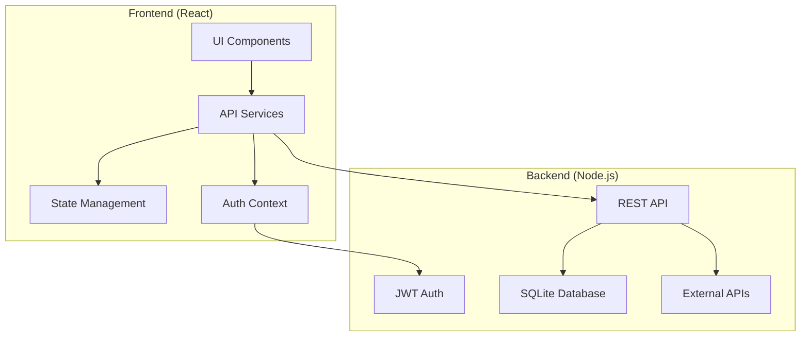

# Design Document

## Overview

The frontend-backend integration design establishes a comprehensive connection between the existing React frontend and the ScholarFinder Node.js backend API. This integration replaces the current mock data implementation with real API communication, enabling full manuscript analysis workflows while maintaining the existing user experience and adding robust error handling, authentication, and performance optimizations.

The design follows a service-oriented architecture pattern where the frontend communicates with the backend through a centralized API service layer, ensuring consistent error handling, authentication management, and data transformation across all components.

## Architecture

### High-Level Architecture



### Frontend Architecture

The frontend will be restructured to use a layered architecture:

1. **Presentation Layer**: React components (existing)
2. **Service Layer**: API communication services (new)
3. **State Management Layer**: React Query for server state + React Context for client state
4. **Authentication Layer**: JWT token management and auth context

### Backend Integration Points

The integration will connect to the following backend endpoints:

- **Authentication**: `/api/auth/*`
- **Process Management**: `/api/processes/*`
- **File Operations**: `/api/processes/:id/upload`, `/api/processes/:id/metadata`
- **Keyword Enhancement**: `/api/processes/:id/keywords/*`
- **Database Search**: `/api/processes/:id/search/*`
- **Validation**: `/api/processes/:id/validate`
- **Recommendations**: `/api/processes/:id/recommendations`
- **Shortlist Management**: `/api/processes/:id/shortlist*`
- **Admin Operations**: `/api/admin/*`

## Components and Interfaces

### 1. API Service Layer

#### Base API Service
```typescript
interface ApiConfig {
  baseURL: string;
  timeout: number;
  retries: number;
}

interface ApiResponse<T> {
  data: T;
  message?: string;
  timestamp: string;
}

interface ApiError {
  type: string;
  message: string;
  details?: any;
  timestamp: string;
}

class ApiService {
  private axiosInstance: AxiosInstance;
  private authToken: string | null;
  
  constructor(config: ApiConfig);
  setAuthToken(token: string): void;
  clearAuthToken(): void;
  request<T>(config: AxiosRequestConfig): Promise<ApiResponse<T>>;
}
```

#### Authentication Service
```typescript
interface LoginCredentials {
  email: string;
  password: string;
}

interface AuthResponse {
  token: string;
  user: {
    id: string;
    email: string;
    role: string;
  };
}

class AuthService {
  login(credentials: LoginCredentials): Promise<AuthResponse>;
  logout(): Promise<void>;
  verifyToken(): Promise<boolean>;
  changePassword(oldPassword: string, newPassword: string): Promise<void>;
  getProfile(): Promise<UserProfile>;
}
```

#### Process Service
```typescript
interface Process {
  id: string;
  title: string;
  description: string;
  currentStep: number;
  status: string;
  createdAt: string;
  updatedAt: string;
}

interface CreateProcessRequest {
  title: string;
  description: string;
}

class ProcessService {
  createProcess(data: CreateProcessRequest): Promise<Process>;
  getProcesses(): Promise<Process[]>;
  getProcess(id: string): Promise<Process>;
  updateProcess(id: string, data: Partial<Process>): Promise<Process>;
  updateProcessStep(id: string, step: number): Promise<Process>;
  deleteProcess(id: string): Promise<void>;
}
```

#### File Service
```typescript
interface UploadResponse {
  fileId: string;
  fileName: string;
  fileSize: number;
  uploadedAt: string;
}

interface ExtractedMetadata {
  title: string;
  abstract: string;
  keywords: string[];
  authors: Author[];
  affiliations: Affiliation[];
}

class FileService {
  uploadFile(processId: string, file: File): Promise<UploadResponse>;
  getMetadata(processId: string): Promise<ExtractedMetadata>;
  updateMetadata(processId: string, metadata: Partial<ExtractedMetadata>): Promise<ExtractedMetadata>;
}
```

#### Keyword Service
```typescript
interface KeywordEnhancementRequest {
  includeOriginal: boolean;
  generateMeshTerms: boolean;
  generateSearchStrings: boolean;
}

interface EnhancedKeywords {
  original: string[];
  enhanced: string[];
  meshTerms: string[];
  searchStrings: {
    pubmed: string;
    elsevier: string;
    wiley: string;
    taylorFrancis: string;
  };
}

class KeywordService {
  enhanceKeywords(processId: string, request: KeywordEnhancementRequest): Promise<EnhancedKeywords>;
  getKeywords(processId: string): Promise<EnhancedKeywords>;
  updateKeywordSelection(processId: string, selection: string[]): Promise<void>;
}
```

#### Search Service
```typescript
interface SearchRequest {
  keywords: string[];
  databases: string[];
  searchOptions: {
    maxResults: number;
    dateRange: {
      from: string;
      to: string;
    };
  };
}

interface SearchStatus {
  status: 'PENDING' | 'IN_PROGRESS' | 'COMPLETED' | 'FAILED';
  progress: {
    pubmed: { status: string; count: number };
    elsevier: { status: string; count: number };
    wiley: { status: string; count: number };
    taylorFrancis: { status: string; count: number };
  };
  totalFound: number;
}

class SearchService {
  initiateSearch(processId: string, request: SearchRequest): Promise<void>;
  getSearchStatus(processId: string): Promise<SearchStatus>;
  searchByName(processId: string, name: string): Promise<Author[]>;
  searchByEmail(processId: string, email: string): Promise<Author[]>;
}
```

### 2. State Management

#### React Query Integration
```typescript
// Custom hooks for API data fetching
const useProcesses = () => useQuery({
  queryKey: ['processes'],
  queryFn: () => processService.getProcesses(),
});

const useProcess = (id: string) => useQuery({
  queryKey: ['process', id],
  queryFn: () => processService.getProcess(id),
  enabled: !!id,
});

const useMetadata = (processId: string) => useQuery({
  queryKey: ['metadata', processId],
  queryFn: () => fileService.getMetadata(processId),
  enabled: !!processId,
});
```

#### Authentication Context
```typescript
interface AuthContextType {
  user: User | null;
  token: string | null;
  login: (credentials: LoginCredentials) => Promise<void>;
  logout: () => Promise<void>;
  isAuthenticated: boolean;
  isLoading: boolean;
}

const AuthContext = createContext<AuthContextType | null>(null);

const AuthProvider: React.FC<{ children: React.ReactNode }> = ({ children }) => {
  // Implementation with JWT token management
};
```

### 3. Component Updates

#### Enhanced Login Form
```typescript
interface LoginFormProps {
  onLogin?: () => void;
}

const LoginForm: React.FC<LoginFormProps> = ({ onLogin }) => {
  const { login } = useAuth();
  const [isLoading, setIsLoading] = useState(false);
  
  const handleSubmit = async (credentials: LoginCredentials) => {
    setIsLoading(true);
    try {
      await login(credentials);
      onLogin?.();
    } catch (error) {
      // Handle error with toast
    } finally {
      setIsLoading(false);
    }
  };
  
  // Form implementation
};
```

#### File Upload Integration
```typescript
const FileUpload: React.FC<FileUploadProps> = ({ processId, onUploadComplete }) => {
  const uploadMutation = useMutation({
    mutationFn: (file: File) => fileService.uploadFile(processId, file),
    onSuccess: (response) => {
      onUploadComplete?.(response);
      queryClient.invalidateQueries(['metadata', processId]);
    },
  });
  
  // Component implementation with real upload
};
```

## Data Models

### Frontend Data Models

```typescript
interface User {
  id: string;
  email: string;
  role: 'USER' | 'ADMIN';
  createdAt: string;
}

interface Author {
  id: string;
  name: string;
  email?: string;
  affiliation: string;
  country: string;
  publicationCount: number;
  recentPublications: string[];
  expertise: string[];
  database: string;
  matchScore: number;
}

interface Reviewer extends Author {
  validationStatus: {
    excludedAsManuscriptAuthor: boolean;
    excludedAsCoAuthor: boolean;
    hasMinimumPublications: boolean;
    hasAcceptableRetractions: boolean;
    hasInstitutionalConflict: boolean;
  };
}

interface Shortlist {
  id: string;
  name: string;
  processId: string;
  selectedReviewers: string[];
  createdAt: string;
  updatedAt: string;
}
```

### API Response Models

```typescript
interface PaginatedResponse<T> {
  data: T[];
  pagination: {
    page: number;
    limit: number;
    total: number;
    totalPages: number;
    hasNextPage: boolean;
    hasPreviousPage: boolean;
  };
}

interface ValidationResults {
  totalCandidates: number;
  validatedReviewers: number;
  excludedReviewers: number;
  validationSteps: {
    manuscriptAuthors: { excluded: number; passed: number };
    coAuthors: { excluded: number; passed: number };
    publications: { excluded: number; passed: number };
    retractions: { excluded: number; passed: number };
    institutions: { excluded: number; passed: number };
  };
}
```

## Error Handling

### Error Classification

1. **Network Errors**: Connection issues, timeouts
2. **Authentication Errors**: Invalid tokens, expired sessions
3. **Validation Errors**: Invalid input data
4. **Business Logic Errors**: Process state conflicts
5. **Server Errors**: Internal server errors
6. **Rate Limiting Errors**: Too many requests

### Error Handling Strategy

```typescript
class ErrorHandler {
  static handle(error: any): UserFriendlyError {
    if (error.response?.status === 401) {
      return {
        type: 'AUTHENTICATION_ERROR',
        message: 'Your session has expired. Please log in again.',
        action: 'REDIRECT_TO_LOGIN'
      };
    }
    
    if (error.response?.status === 429) {
      return {
        type: 'RATE_LIMIT_ERROR',
        message: 'Too many requests. Please wait before trying again.',
        retryAfter: error.response.headers['retry-after']
      };
    }
    
    // Additional error handling logic
  }
}

// Global error boundary
const ErrorBoundary: React.FC<{ children: React.ReactNode }> = ({ children }) => {
  return (
    <ReactErrorBoundary
      FallbackComponent={ErrorFallback}
      onError={(error, errorInfo) => {
        console.error('Application error:', error, errorInfo);
        // Log to monitoring service
      }}
    >
      {children}
    </ReactErrorBoundary>
  );
};
```

### Toast Notification System

```typescript
interface ToastConfig {
  title: string;
  description?: string;
  variant: 'default' | 'destructive' | 'success';
  duration?: number;
}

const useApiToast = () => {
  const { toast } = useToast();
  
  const showError = (error: any) => {
    const userError = ErrorHandler.handle(error);
    toast({
      title: 'Error',
      description: userError.message,
      variant: 'destructive',
    });
  };
  
  const showSuccess = (message: string) => {
    toast({
      title: 'Success',
      description: message,
      variant: 'success',
    });
  };
  
  return { showError, showSuccess };
};
```

## Testing Strategy

### Unit Testing

1. **Service Layer Tests**: Mock API responses and test service methods
2. **Component Tests**: Test component behavior with mocked services
3. **Hook Tests**: Test custom hooks with React Testing Library
4. **Utility Tests**: Test helper functions and utilities

### Integration Testing

1. **API Integration Tests**: Test actual API communication with test backend
2. **Authentication Flow Tests**: Test login/logout workflows
3. **File Upload Tests**: Test file upload and processing
4. **End-to-End Workflow Tests**: Test complete manuscript analysis workflow

### Testing Tools

- **Jest**: Unit and integration testing
- **React Testing Library**: Component testing
- **MSW (Mock Service Worker)**: API mocking for tests
- **Cypress**: End-to-end testing

### Test Configuration

```typescript
// API mocking for tests
const server = setupServer(
  rest.post('/api/auth/login', (req, res, ctx) => {
    return res(ctx.json({ token: 'mock-token', user: mockUser }));
  }),
  rest.get('/api/processes', (req, res, ctx) => {
    return res(ctx.json({ data: mockProcesses }));
  }),
  // Additional mock handlers
);

beforeAll(() => server.listen());
afterEach(() => server.resetHandlers());
afterAll(() => server.close());
```

## Performance Optimizations

### Caching Strategy

1. **React Query Caching**: Automatic caching of API responses
2. **Local Storage**: Cache non-sensitive user preferences
3. **Memory Caching**: Cache computed data and transformations

### Loading States

```typescript
const ProcessDashboard: React.FC = () => {
  const { data: processes, isLoading, error } = useProcesses();
  
  if (isLoading) return <ProcessesSkeleton />;
  if (error) return <ErrorMessage error={error} />;
  
  return <ProcessesList processes={processes} />;
};

// Skeleton components for loading states
const ProcessesSkeleton: React.FC = () => (
  <div className="space-y-4">
    {Array.from({ length: 3 }).map((_, i) => (
      <Skeleton key={i} className="h-20 w-full" />
    ))}
  </div>
);
```

### Pagination and Virtual Scrolling

```typescript
const ReviewerResults: React.FC = ({ processId }) => {
  const [page, setPage] = useState(1);
  const { data, isLoading } = useRecommendations(processId, { page, limit: 20 });
  
  return (
    <div>
      <VirtualizedList
        items={data?.data || []}
        renderItem={({ item }) => <ReviewerCard reviewer={item} />}
        height={600}
        itemHeight={120}
      />
      <Pagination
        currentPage={page}
        totalPages={data?.pagination.totalPages || 1}
        onPageChange={setPage}
      />
    </div>
  );
};
```

## Security Considerations

### JWT Token Management

```typescript
class TokenManager {
  private static readonly TOKEN_KEY = 'scholarfinder_token';
  
  static setToken(token: string): void {
    localStorage.setItem(this.TOKEN_KEY, token);
  }
  
  static getToken(): string | null {
    return localStorage.getItem(this.TOKEN_KEY);
  }
  
  static clearToken(): void {
    localStorage.removeItem(this.TOKEN_KEY);
  }
  
  static isTokenExpired(token: string): boolean {
    try {
      const payload = JSON.parse(atob(token.split('.')[1]));
      return payload.exp * 1000 < Date.now();
    } catch {
      return true;
    }
  }
}
```

### Request Interceptors

```typescript
// Axios interceptors for authentication and error handling
apiService.interceptors.request.use((config) => {
  const token = TokenManager.getToken();
  if (token && !TokenManager.isTokenExpired(token)) {
    config.headers.Authorization = `Bearer ${token}`;
  }
  return config;
});

apiService.interceptors.response.use(
  (response) => response,
  (error) => {
    if (error.response?.status === 401) {
      TokenManager.clearToken();
      window.location.href = '/login';
    }
    return Promise.reject(error);
  }
);
```

## Configuration Management

### Environment Configuration

```typescript
interface AppConfig {
  apiBaseUrl: string;
  apiTimeout: number;
  maxFileSize: number;
  supportedFileTypes: string[];
  enableDevTools: boolean;
}

const config: AppConfig = {
  apiBaseUrl: import.meta.env.VITE_API_BASE_URL || 'http://localhost:3001',
  apiTimeout: parseInt(import.meta.env.VITE_API_TIMEOUT || '30000'),
  maxFileSize: parseInt(import.meta.env.VITE_MAX_FILE_SIZE || '10485760'),
  supportedFileTypes: (import.meta.env.VITE_SUPPORTED_FILE_TYPES || 'pdf,docx,doc').split(','),
  enableDevTools: import.meta.env.DEV,
};

export default config;
```

### Environment Files

```bash
# .env.development
VITE_API_BASE_URL=http://localhost:3001
VITE_API_TIMEOUT=30000
VITE_MAX_FILE_SIZE=10485760
VITE_SUPPORTED_FILE_TYPES=pdf,docx,doc

# .env.production
VITE_API_BASE_URL=https://api.scholarfinder.com
VITE_API_TIMEOUT=30000
VITE_MAX_FILE_SIZE=10485760
VITE_SUPPORTED_FILE_TYPES=pdf,docx,doc
```

## Migration Strategy

### Phase 1: Infrastructure Setup
1. Set up API service layer
2. Implement authentication context
3. Configure React Query
4. Set up error handling

### Phase 2: Core Integration
1. Replace authentication with real API
2. Integrate process management
3. Connect file upload and metadata extraction
4. Implement keyword enhancement

### Phase 3: Advanced Features
1. Connect database search functionality
2. Implement author validation
3. Integrate recommendation system
4. Connect shortlist management

### Phase 4: Admin and Optimization
1. Implement admin dashboard integration
2. Add performance optimizations
3. Implement comprehensive error handling
4. Add monitoring and analytics

## Monitoring and Analytics

### Error Tracking

```typescript
interface ErrorEvent {
  error: Error;
  context: {
    userId?: string;
    processId?: string;
    component: string;
    action: string;
  };
  timestamp: string;
}

class ErrorTracker {
  static track(error: Error, context: any): void {
    const errorEvent: ErrorEvent = {
      error,
      context,
      timestamp: new Date().toISOString(),
    };
    
    // Send to monitoring service
    console.error('Application Error:', errorEvent);
  }
}
```

### Performance Monitoring

```typescript
const usePerformanceMonitoring = () => {
  const trackApiCall = (endpoint: string, duration: number) => {
    // Track API performance
    console.log(`API Call: ${endpoint} took ${duration}ms`);
  };
  
  const trackComponentRender = (componentName: string, renderTime: number) => {
    // Track component performance
    console.log(`Component ${componentName} rendered in ${renderTime}ms`);
  };
  
  return { trackApiCall, trackComponentRender };
};
```