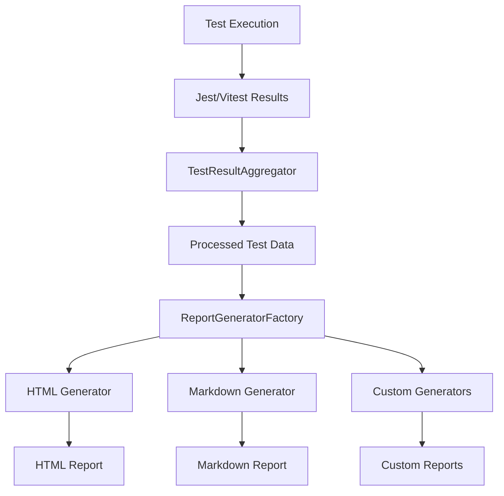

# Test Reporting Developer Guide

## Overview

This guide provides detailed information for developers who want to extend, customize, or contribute to the ScholarFinder automated test reporting system.

## Architecture

### System Components

```
test-reporting/
├── src/test/reporting/
│   ├── ReportGenerator.ts          # Base interface
│   ├── HtmlReportGenerator.ts      # HTML report implementation
│   ├── MarkdownReportGenerator.ts  # Markdown report implementation
│   ├── ReportGeneratorFactory.ts   # Factory pattern
│   ├── TestResultAggregator.ts     # Data processing
│   ├── templates/                  # Report templates
│   │   ├── html-report.hbs
│   │   └── markdown-report.hbs
│   └── utils/                      # Utility functions
│       ├── fileUtils.ts
│       ├── templateUtils.ts
│       └── performanceUtils.ts
├── scripts/
│   └── run-comprehensive-tests.js  # Main test runner
└── test-reporting.config.js        # Configuration
```

### Data Flow



## Core Interfaces

### ReportGenerator Interface

```typescript
export interface ReportGenerator {
  /**
   * Generate a report from test results
   * @param testResults - Aggregated test results
   * @param config - Report configuration
   * @returns Promise that resolves when report is generated
   */
  generate(testResults: TestResults, config: ReportConfig): Promise<void>;
  
  /**
   * Validate that the generator can run with current configuration
   * @param config - Report configuration
   * @returns true if valid, error message if invalid
   */
  validate(config: ReportConfig): boolean | string;
  
  /**
   * Get the file extension for this report type
   */
  getFileExtension(): string;
  
  /**
   * Get human-readable name for this report type
   */
  getDisplayName(): string;
}
```

### TestResults Interface

```typescript
export interface TestResults {
  summary: {
    totalTests: number;
    passedTests: number;
    failedTests: number;
    skippedTests: number;
    duration: number;
    successRate: number;
  };
  
  testSuites: TestSuite[];
  coverage?: CoverageData;
  performance?: PerformanceMetrics;
  environment: EnvironmentInfo;
  timestamp: string;
}

export interface TestSuite {
  name: string;
  file: string;
  duration: number;
  tests: TestCase[];
  status: 'passed' | 'failed' | 'skipped';
}

export interface TestCase {
  name: string;
  status: 'passed' | 'failed' | 'skipped';
  duration: number;
  error?: TestError;
  retries?: number;
}
```

## Creating Custom Report Generators

### Step 1: Implement the Interface

```typescript
// CustomReportGenerator.ts
import { ReportGenerator, TestResults, ReportConfig } from '../types';
import { writeFile } from 'fs/promises';
import { join } from 'path';

export class CustomReportGenerator implements ReportGenerator {
  async generate(testResults: TestResults, config: ReportConfig): Promise<void> {
    // Your custom report generation logic
    const reportContent = this.formatReport(testResults, config);
    
    const outputPath = join(config.outputDir, `custom-report.${this.getFileExtension()}`);
    await writeFile(outputPath, reportContent, 'utf8');
    
    console.log(`Custom report generated: ${outputPath}`);
  }
  
  validate(config: ReportConfig): boolean | string {
    if (!config.outputDir) {
      return 'Output directory is required';
    }
    
    // Add your validation logic
    return true;
  }
  
  getFileExtension(): string {
    return 'custom';
  }
  
  getDisplayName(): string {
    return 'Custom Report';
  }
  
  private formatReport(testResults: TestResults, config: ReportConfig): string {
    // Implement your custom formatting logic
    return `
# Custom Test Report

Total Tests: ${testResults.summary.totalTests}
Passed: ${testResults.summary.passedTests}
Failed: ${testResults.summary.failedTests}
Success Rate: ${testResults.summary.successRate}%

Generated at: ${testResults.timestamp}
    `.trim();
  }
}
```

### Step 2: Register with Factory

```typescript
// ReportGeneratorFactory.ts
import { CustomReportGenerator } from './CustomReportGenerator';

export class ReportGeneratorFactory {
  private static generators = new Map<string, () => ReportGenerator>([
    ['html', () => new HtmlReportGenerator()],
    ['markdown', () => new MarkdownReportGenerator()],
    ['custom', () => new CustomReportGenerator()], // Add your generator
  ]);
  
  static create(format: string): ReportGenerator {
    const generatorFactory = this.generators.get(format.toLowerCase());
    if (!generatorFactory) {
      throw new Error(`Unknown report format: ${format}`);
    }
    return generatorFactory();
  }
  
  static getSupportedFormats(): string[] {
    return Array.from(this.generators.keys());
  }
  
  // Allow runtime registration of custom generators
  static register(format: string, generatorFactory: () => ReportGenerator): void {
    this.generators.set(format.toLowerCase(), generatorFactory);
  }
}
```

### Step 3: Update Configuration

```javascript
// test-reporting.config.js
module.exports = {
  formats: ['html', 'markdown', 'custom'], // Include your format
  
  // Custom generator configuration
  customOptions: {
    includeDetailedErrors: true,
    formatStyle: 'compact',
    customField: 'value'
  }
};
```

## Advanced Customization

### Custom Templates

#### HTML Templates with Handlebars

```handlebars
<!-- templates/custom-html.hbs -->
<!DOCTYPE html>
<html>
<head>
    <title>{{title}}</title>
    <style>
        /* Your custom styles */
        .custom-header { background: #your-color; }
    </style>
</head>
<body>
    <div class="custom-header">
        <h1>{{title}}</h1>
        <p>Generated: {{timestamp}}</p>
    </div>
    
    <div class="summary">
        <div class="metric">
            <span class="label">Total Tests:</span>
            <span class="value">{{summary.totalTests}}</span>
        </div>
        <div class="metric">
            <span class="label">Success Rate:</span>
            <span class="value">{{summary.successRate}}%</span>
        </div>
    </div>
    
    {{#each testSuites}}
    <div class="test-suite">
        <h2>{{name}}</h2>
        <div class="tests">
            {{#each tests}}
            <div class="test {{status}}">
                <span class="name">{{name}}</span>
                <span class="duration">{{duration}}ms</span>
                {{#if error}}
                <div class="error">{{error.message}}</div>
                {{/if}}
            </div>
            {{/each}}
        </div>
    </div>
    {{/each}}
</body>
</html>
```

#### Using Custom Templates

```typescript
export class CustomHtmlReportGenerator implements ReportGenerator {
  async generate(testResults: TestResults, config: ReportConfig): Promise<void> {
    const Handlebars = require('handlebars');
    const fs = require('fs/promises');
    
    // Load custom template
    const templatePath = config.customTemplate || './templates/custom-html.hbs';
    const templateSource = await fs.readFile(templatePath, 'utf8');
    const template = Handlebars.compile(templateSource);
    
    // Register custom helpers
    Handlebars.registerHelper('formatDuration', (duration: number) => {
      return duration > 1000 ? `${(duration / 1000).toFixed(1)}s` : `${duration}ms`;
    });
    
    Handlebars.registerHelper('statusIcon', (status: string) => {
      const icons = { passed: '✅', failed: '❌', skipped: '⏭️' };
      return icons[status] || '❓';
    });
    
    // Generate report
    const html = template({
      title: config.title || 'Test Report',
      timestamp: new Date().toISOString(),
      ...testResults
    });
    
    const outputPath = join(config.outputDir, 'custom-report.html');
    await fs.writeFile(outputPath, html, 'utf8');
  }
}
```

### Data Processing Extensions

#### Custom Test Result Aggregation

```typescript
export class EnhancedTestResultAggregator extends TestResultAggregator {
  async aggregate(rawResults: any): Promise<TestResults> {
    const baseResults = await super.aggregate(rawResults);
    
    // Add custom metrics
    const enhancedResults = {
      ...baseResults,
      customMetrics: {
        averageTestDuration: this.calculateAverageTestDuration(baseResults),
        slowestTests: this.findSlowestTests(baseResults, 10),
        testsByCategory: this.categorizeTests(baseResults),
        flakiness: this.calculateFlakiness(baseResults),
        trends: await this.calculateTrends(baseResults)
      }
    };
    
    return enhancedResults;
  }
  
  private calculateAverageTestDuration(results: TestResults): number {
    const totalDuration = results.testSuites.reduce((sum, suite) => 
      sum + suite.tests.reduce((testSum, test) => testSum + test.duration, 0), 0
    );
    return totalDuration / results.summary.totalTests;
  }
  
  private findSlowestTests(results: TestResults, count: number): TestCase[] {
    const allTests = results.testSuites.flatMap(suite => 
      suite.tests.map(test => ({ ...test, suite: suite.name }))
    );
    return allTests
      .sort((a, b) => b.duration - a.duration)
      .slice(0, count);
  }
  
  private categorizeTests(results: TestResults): Record<string, number> {
    const categories = {
      unit: 0,
      integration: 0,
      e2e: 0,
      performance: 0
    };
    
    results.testSuites.forEach(suite => {
      const category = this.detectCategory(suite.name);
      categories[category] += suite.tests.length;
    });
    
    return categories;
  }
  
  private detectCategory(suiteName: string): string {
    if (suiteName.includes('integration')) return 'integration';
    if (suiteName.includes('e2e') || suiteName.includes('end-to-end')) return 'e2e';
    if (suiteName.includes('performance') || suiteName.includes('load')) return 'performance';
    return 'unit';
  }
}
```

### Plugin System

#### Creating Plugins

```typescript
export interface ReportPlugin {
  name: string;
  version: string;
  
  // Lifecycle hooks
  beforeGeneration?(testResults: TestResults, config: ReportConfig): Promise<void>;
  afterGeneration?(testResults: TestResults, config: ReportConfig): Promise<void>;
  
  // Data transformation
  transformResults?(testResults: TestResults): Promise<TestResults>;
  
  // Custom generators
  getCustomGenerators?(): Map<string, () => ReportGenerator>;
}

// Example plugin
export class SlackNotificationPlugin implements ReportPlugin {
  name = 'slack-notification';
  version = '1.0.0';
  
  constructor(private webhookUrl: string) {}
  
  async afterGeneration(testResults: TestResults, config: ReportConfig): Promise<void> {
    if (testResults.summary.failedTests > 0) {
      await this.sendSlackNotification({
        text: `❌ Tests failed: ${testResults.summary.failedTests}/${testResults.summary.totalTests}`,
        color: 'danger',
        fields: [
          {
            title: 'Success Rate',
            value: `${testResults.summary.successRate}%`,
            short: true
          },
          {
            title: 'Duration',
            value: `${testResults.summary.duration}ms`,
            short: true
          }
        ]
      });
    }
  }
  
  private async sendSlackNotification(message: any): Promise<void> {
    const response = await fetch(this.webhookUrl, {
      method: 'POST',
      headers: { 'Content-Type': 'application/json' },
      body: JSON.stringify(message)
    });
    
    if (!response.ok) {
      console.error('Failed to send Slack notification:', response.statusText);
    }
  }
}
```

#### Using Plugins

```javascript
// test-reporting.config.js
const { SlackNotificationPlugin } = require('./plugins/SlackNotificationPlugin');

module.exports = {
  plugins: [
    new SlackNotificationPlugin(process.env.SLACK_WEBHOOK_URL)
  ]
};
```

## Testing Your Extensions

### Unit Testing Custom Generators

```typescript
// CustomReportGenerator.test.ts
import { CustomReportGenerator } from '../CustomReportGenerator';
import { TestResults, ReportConfig } from '../types';
import { readFile } from 'fs/promises';
import { join } from 'path';

describe('CustomReportGenerator', () => {
  let generator: CustomReportGenerator;
  let mockTestResults: TestResults;
  let mockConfig: ReportConfig;
  
  beforeEach(() => {
    generator = new CustomReportGenerator();
    mockTestResults = {
      summary: {
        totalTests: 100,
        passedTests: 95,
        failedTests: 5,
        skippedTests: 0,
        duration: 30000,
        successRate: 95
      },
      testSuites: [],
      environment: {},
      timestamp: '2024-01-01T00:00:00Z'
    };
    mockConfig = {
      outputDir: './test-output',
      formats: ['custom']
    };
  });
  
  it('should generate a custom report', async () => {
    await generator.generate(mockTestResults, mockConfig);
    
    const reportPath = join(mockConfig.outputDir, 'custom-report.custom');
    const reportContent = await readFile(reportPath, 'utf8');
    
    expect(reportContent).toContain('Total Tests: 100');
    expect(reportContent).toContain('Passed: 95');
    expect(reportContent).toContain('Failed: 5');
    expect(reportContent).toContain('Success Rate: 95%');
  });
  
  it('should validate configuration correctly', () => {
    expect(generator.validate(mockConfig)).toBe(true);
    expect(generator.validate({ ...mockConfig, outputDir: '' }))
      .toBe('Output directory is required');
  });
  
  it('should return correct file extension', () => {
    expect(generator.getFileExtension()).toBe('custom');
  });
  
  it('should return correct display name', () => {
    expect(generator.getDisplayName()).toBe('Custom Report');
  });
});
```

### Integration Testing

```typescript
// integration.test.ts
import { ReportGeneratorFactory } from '../ReportGeneratorFactory';
import { CustomReportGenerator } from '../CustomReportGenerator';

describe('Report Generation Integration', () => {
  beforeAll(() => {
    // Register custom generator
    ReportGeneratorFactory.register('custom', () => new CustomReportGenerator());
  });
  
  it('should create custom generator from factory', () => {
    const generator = ReportGeneratorFactory.create('custom');
    expect(generator).toBeInstanceOf(CustomReportGenerator);
  });
  
  it('should include custom format in supported formats', () => {
    const formats = ReportGeneratorFactory.getSupportedFormats();
    expect(formats).toContain('custom');
  });
});
```

## Performance Optimization

### Streaming for Large Datasets

```typescript
import { Transform, pipeline } from 'stream';
import { createWriteStream } from 'fs';

export class StreamingReportGenerator implements ReportGenerator {
  async generate(testResults: TestResults, config: ReportConfig): Promise<void> {
    const outputPath = join(config.outputDir, 'streaming-report.html');
    const writeStream = createWriteStream(outputPath);
    
    // Write header
    writeStream.write(this.generateHeader(testResults));
    
    // Stream test suites
    await this.streamTestSuites(testResults.testSuites, writeStream);
    
    // Write footer
    writeStream.write(this.generateFooter());
    writeStream.end();
  }
  
  private async streamTestSuites(testSuites: TestSuite[], writeStream: any): Promise<void> {
    for (const suite of testSuites) {
      writeStream.write(this.generateSuiteHtml(suite));
      
      // Process tests in batches to manage memory
      const batchSize = 100;
      for (let i = 0; i < suite.tests.length; i += batchSize) {
        const batch = suite.tests.slice(i, i + batchSize);
        const batchHtml = batch.map(test => this.generateTestHtml(test)).join('');
        writeStream.write(batchHtml);
        
        // Allow event loop to process other tasks
        await new Promise(resolve => setImmediate(resolve));
      }
    }
  }
}
```

### Parallel Processing

```typescript
import { Worker, isMainThread, parentPort, workerData } from 'worker_threads';
import { cpus } from 'os';

export class ParallelReportGenerator implements ReportGenerator {
  async generate(testResults: TestResults, config: ReportConfig): Promise<void> {
    const numWorkers = Math.min(cpus().length, config.maxWorkers || 4);
    const chunkSize = Math.ceil(testResults.testSuites.length / numWorkers);
    
    const workers = [];
    const promises = [];
    
    for (let i = 0; i < numWorkers; i++) {
      const start = i * chunkSize;
      const end = Math.min(start + chunkSize, testResults.testSuites.length);
      const chunk = testResults.testSuites.slice(start, end);
      
      if (chunk.length > 0) {
        const worker = new Worker(__filename, {
          workerData: { chunk, config, workerId: i }
        });
        
        workers.push(worker);
        promises.push(new Promise((resolve, reject) => {
          worker.on('message', resolve);
          worker.on('error', reject);
        }));
      }
    }
    
    const results = await Promise.all(promises);
    
    // Combine results from all workers
    await this.combineResults(results, config);
    
    // Clean up workers
    workers.forEach(worker => worker.terminate());
  }
  
  private async combineResults(results: any[], config: ReportConfig): Promise<void> {
    // Combine partial results into final report
    const combinedHtml = results.join('\n');
    const outputPath = join(config.outputDir, 'parallel-report.html');
    await writeFile(outputPath, combinedHtml, 'utf8');
  }
}

// Worker thread code
if (!isMainThread) {
  const { chunk, config, workerId } = workerData;
  
  // Process chunk
  const processedChunk = chunk.map(suite => {
    // Generate HTML for this suite
    return generateSuiteHtml(suite);
  }).join('\n');
  
  parentPort?.postMessage(processedChunk);
}
```

## Best Practices

### Error Handling

```typescript
export class RobustReportGenerator implements ReportGenerator {
  async generate(testResults: TestResults, config: ReportConfig): Promise<void> {
    try {
      await this.generateReport(testResults, config);
    } catch (error) {
      console.error('Report generation failed:', error);
      
      // Attempt fallback generation
      try {
        await this.generateFallbackReport(testResults, config);
        console.log('Fallback report generated successfully');
      } catch (fallbackError) {
        console.error('Fallback report generation also failed:', fallbackError);
        
        // Generate minimal report with error information
        await this.generateErrorReport(error, fallbackError, config);
      }
    }
  }
  
  private async generateFallbackReport(testResults: TestResults, config: ReportConfig): Promise<void> {
    // Simplified report generation with minimal dependencies
    const simpleReport = `
# Test Report (Fallback)

**Error occurred during normal report generation**

## Summary
- Total Tests: ${testResults.summary.totalTests}
- Passed: ${testResults.summary.passedTests}
- Failed: ${testResults.summary.failedTests}
- Success Rate: ${testResults.summary.successRate}%

Generated: ${new Date().toISOString()}
    `;
    
    const outputPath = join(config.outputDir, 'fallback-report.md');
    await writeFile(outputPath, simpleReport, 'utf8');
  }
  
  private async generateErrorReport(originalError: Error, fallbackError: Error, config: ReportConfig): Promise<void> {
    const errorReport = `
# Report Generation Error

## Original Error
${originalError.message}
${originalError.stack}

## Fallback Error
${fallbackError.message}
${fallbackError.stack}

## Troubleshooting
1. Check configuration file syntax
2. Verify output directory permissions
3. Ensure all dependencies are installed
4. Enable debug mode: DEBUG_TEST_REPORTING=true

Generated: ${new Date().toISOString()}
    `;
    
    const outputPath = join(config.outputDir, 'error-report.md');
    await writeFile(outputPath, errorReport, 'utf8');
  }
}
```

### Configuration Validation

```typescript
import Joi from 'joi';

const configSchema = Joi.object({
  outputDir: Joi.string().required(),
  formats: Joi.array().items(Joi.string()).min(1).required(),
  includeCoverage: Joi.boolean().default(true),
  htmlTemplate: Joi.object({
    title: Joi.string().default('Test Report'),
    theme: Joi.string().valid('modern', 'classic', 'minimal').default('modern'),
    includeCharts: Joi.boolean().default(true)
  }).default({}),
  performance: Joi.object({
    trackMemoryUsage: Joi.boolean().default(true),
    slowTestThreshold: Joi.number().min(0).default(5000)
  }).default({})
});

export function validateConfig(config: any): ReportConfig {
  const { error, value } = configSchema.validate(config, {
    allowUnknown: true,
    stripUnknown: false
  });
  
  if (error) {
    throw new Error(`Configuration validation failed: ${error.message}`);
  }
  
  return value;
}
```

## Contributing

### Development Setup

```bash
# Clone the repository
git clone <repository-url>
cd scholarfinder

# Install dependencies
npm install

# Run tests
npm run test

# Run tests with coverage
npm run test:coverage

# Generate sample reports
npm run test:all
```

### Code Style

- Use TypeScript for all new code
- Follow existing ESLint configuration
- Write comprehensive tests for new features
- Document public APIs with JSDoc comments
- Use meaningful variable and function names

### Pull Request Process

1. Create a feature branch from `main`
2. Implement your changes with tests
3. Update documentation as needed
4. Ensure all tests pass
5. Submit pull request with detailed description

### Release Process

1. Update version in `package.json`
2. Update `CHANGELOG.md`
3. Create git tag
4. Publish to npm (if applicable)
5. Update documentation

This developer guide provides the foundation for extending and customizing the test reporting system. For specific questions or advanced use cases, please refer to the source code or create an issue in the repository.